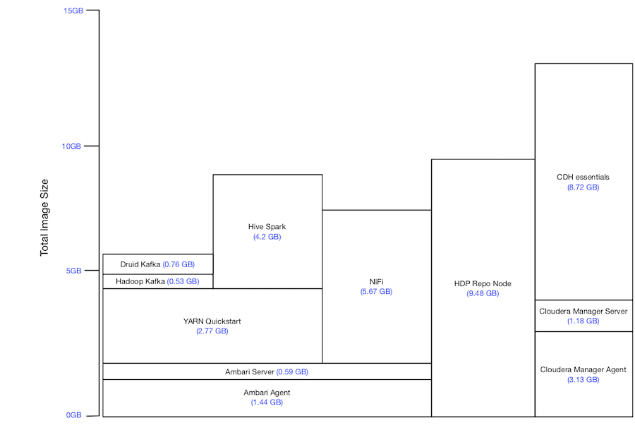

# Amber
Amber provides a solution for running Ambari cluster in Docker. It was designed to streamline training, testing, and development by enabling multi-node **dev/test** clusters to be installed on a single machine with minimal resource requirements. 

## Update January 9, 2019
1. Workarounds to support Docker on YARN (in Docker)
2. Ports can now be configured in ini file
3. More samples

## Update December 10, 2018
1. Pre-built images can now be pulled from docker hub

## Pre-built Images
Pre-built versions of the single node samples have been loaded into docker hub. They can be configured with their respective ini files and launched with the following commands: 
```
./amber.sh createFromPrebuiltSample samples/yarnquickstart/yarnquickstart-sample.ini
./amber.sh createFromPrebuiltSample samples/hadoopkafka/hadoopkafka-sample.ini
./amber.sh createFromPrebuiltSample samples/hivespark/hivespark-sample.ini
./amber.sh createFromPrebuiltSample samples/nifiNode/nifiNode-sample.ini
```
Docker images are composed of layers that can be shared by other images. This allows for a great reduction in the total size of images on disk and over the network. Amber's pre-built images are composed as much as possible to take advantage of this feature. 

The following graph shows how the images built on top of each other. For example, Amber_Agent + Amber_Server + YarnQuickstart + HadoopKafka is a total of 5.44 GB in size, but all four layers are less than 3GB each and each can be reused for other containers.


## Prerequisites
* 8GB RAM and 30GB disk is recommended for the threeNode sample configuration. 4GB RAM or less is viable for smaller clusters.

* Docker 17 
    ```
    yum install -y yum-utils device-mapper-persistent-data lvm2
    yum-config-manager --add-repo https://download.docker.com/linux/centos/docker-ce.repo
    yum install -y docker-ce
    ```

* (Optional) Configure for External Network Access to Nodes    
  1. Add multiple IPs to Host OS (N+1 for N nodes)  
    * Use VMWare/VirtualBox/etc. to add network adaptors to the VM
    * For example, the threeNode-sample configuration requires 4 IPs: 1 for host, 3 for the cluster.  
  2. Limit SSH on host VM to a Single IP. By default, SSH listens on 0.0.0.0
     * Edit sshd_config
       ```
       vi /etc/ssh/sshd_config  
       ```  
     * Add the following line with the IP address for the host OS:  
       ```
       ListenAddress <IP Address>  
       ```  
     * Restart sshd  
       ```
       service sshd restart  
       ```      
  3. Enable IPv4 forwarding  
      ```
      sysctl -w net.ipv4.ip_forward=1  
      ```

## Configuration
An .ini file is required to define hostnames and a cluster name. An external IP list can be defined to allow external access to the containers. 

HDP can be installed manually or through Ambari Blueprints. Example blueprint files are provided in the samples folder.

#### INI Fields:

* clusterName (required)
* ambariServerHostName (required)
* hostNames (required)
* ports (Optional, comma separated list of ports to bind) (Default: all HDP and HDF ports)
* externalIPs (Optional, only necessary for access from outside the host machine)

* ambariVersion (required) (Default is 2.7.1.0)
* hdpVersion (required to use blueprint script) (Default is 3.0.1.0-187)
* blueprintName (required to use blueprint script)
* blueprintFile (required to use blueprint script)
* blueprintHostMappingFile (required to use blueprint script) 
* mPacks (Optional, comma separated list of mPack URLs)
* buildRepo=true (Optional, creates a container with a local yum repo for HDP) 

Note: The HDP build number must be specified. It can be found in the HDP repo path (e.g. https://docs.hortonworks.com/HDPDocuments/Ambari-2.7.1.0/bk_ambari-installation-ppc/content/hdp_30_repositories.html).

## Docker images
Amber uses three docker images. HDP and Ambari versions are configurable, and multiple versions can exist on the same host. Ambari mPacks (such as for HDF or HDPSearch) are also configurable.

1. **HDP Repo Image (Optional)** This container installs and runs a local HDP repo. Creating this image will take time initially, but will greatly speed up all future HDP installs.
1. **Ambari Server Image:** This container installs and runs the Ambari Server and Ambari Agent. If mPacks are defined, they will be installed into Ambari Server as well.
2. **Ambari Agent Image:** This container runs an Ambari Agent process. For multi-node cluster deployments, all nodes except the node designated as the Ambari Server node will be based on this image.

```
./amber.sh pullImages samples/yarnquickstart/yarnquickstart-sample.ini
or
./amber.sh buildImages samples/yarnquickstart/yarnquickstart-sample.ini
```

## Creating a Cluster
A blank Ambari cluster is the starting point:
```
./amber.sh createCluster samples/yarnquickstart/yarnquickstart-sample.ini
```

## Installing HDP
Once the Ambari cluster is created, the Ambari UI or blueprints can be used to install the rest of the cluster services. 

To use blueprints, add blueprint fields to the ini file to use the included script. Sample blueprints and host mapping files are provided in the samples directory.

```
./amber.sh installCluster samples/yarnquickstart/yarnquickstart-sample.ini
```

## Supporting Files/Scripts
This project includes several additional utility methods: 

1. **Install Status:** Monitor the status of a cluster install (the Ambari UI could also be used)

    ```
    ./amber.sh installStatus samples/yarnquickstart/yarnquickstart-sample.ini
    ```

2. **Stats:** Monitor the resource utilization of a cluster based on the built-in `docker status` command
        
    ```
    ./amber.sh stats samples/yarnquickstart/yarnquickstart-sample.ini
    ```

3. **Create Node:** Create a new node. Note: does not install services or add to Ambari
        
    ```
    ./amber.sh createNode samples/yarnquickstart/yarnquickstart-sample.ini worker1 172.16.96.140
    ```

4. **Export Blueprint:** Export blueprint from Ambari

    ```
    ./amber.sh exportBlueprint samples/yarnquickstart/yarnquickstart-sample.ini > blueprint.json
    ```

5. **Destroy Cluster:** Completely remove all nodes from the cluster. Not reversible!

    ```
    ./amber.sh destroyCluster samples/yarnquickstart/yarnquickstart-sample.ini
    ```

## Notes
1. A local repository to really accelerate installs.
2. Ambari can be stopped when not in use to save on memory
   ```
   docker exec -it resourcemanager.yarnquickstart bash -c "ambari-server stop; ambari-agent stop"
   docker exec -it resourcemanager.yarnquickstart bash -c "ambari-server start; ambari-agent start"
   ```
2. Multiple clusters can reside on the same machine as long as the cluster names (and external IPs) are unique. The docker container names have ".{clusterName}" appended.
3. The containers are configured to autostart if they were not manually stopped. Run this command to autostart the docker service.
   ```
   systemctl enable docker
   ```
4. Installing Oozie requires following these steps: https://docs.hortonworks.com/HDPDocuments/Ambari-2.7.1.0/managing-and-monitoring-ambari/content/amb_enable_the_oozie_ui.html
 
## Potential Enhancements
1. Additional samples
    - HA
    - HDF
    - Standalone use cases (streaming, data science, batch, etc.)
2. Add Kerberos support
3. Add local repo for mPack services
4. Optimize settings to reduce footprint and improve performance
